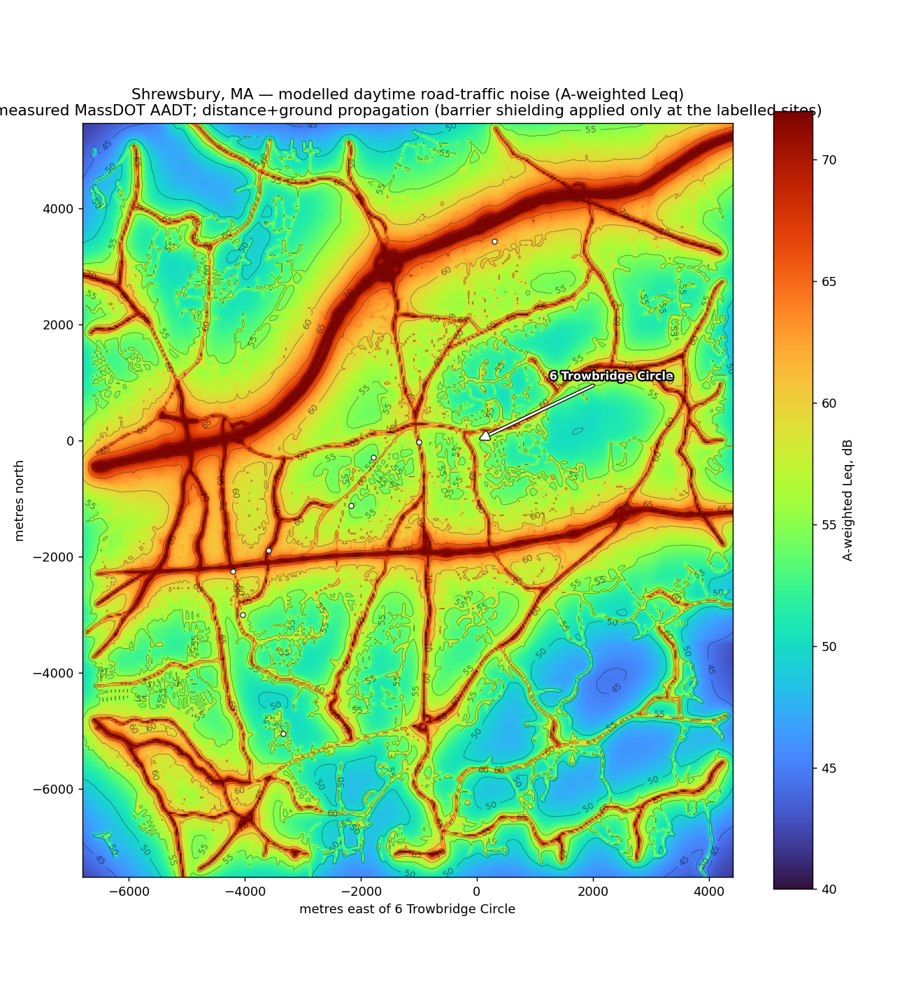

# How loud is 6 Trowbridge Circle vs. the rest of Shrewsbury, MA?

A comprehensive, data-driven **estimate** of outdoor daytime noise. Road
traffic is by far the dominant outdoor noise source in a suburb, so the model
builds the traffic-noise field across town from **measured** inputs and a
physically grounded propagation model, then reads it off at 6 Trowbridge
Circle and at comparison locations.



## TL;DR

6 Trowbridge Circle sits in the **quietest tier** of Shrewsbury — a modelled
daytime Leq of about **51 dB(A)**, tied with the town-center/common area and
several dB below other residential streets. It is a cul-de-sac shielded from
Main Street by intervening houses, and it is **1–3 km from every state
highway**. Homes fronting Route 9, Route 140 or near I-290 are **15–23 dB
louder**, i.e. roughly **3–5× louder** to the ear.

| Location | Leq dB(A) | vs. Trowbridge |
|---|---:|---|
| Shrewsbury Town Hall / common | 49.3 | −1 (about the same) |
| 17A EK Court (off S. Grafton St) | 50.1 | −1 (about the same) |
| **6 Trowbridge Circle (target)** | **50.7** | reference |
| Sherwood Ave (mid-town residential) | 54.4 | +4 (~1.3× louder) |
| Jordan Rd (Fairlawn, near lake) | 55.0 | +4 (~1.3× louder) |
| Edgemere (residential, off Rt 20) | 55.3 | +5 (~1.4× louder) |
| Reservoir St (far north, near I-290) | 61.1 | +10 (~2× louder) |
| Quinsigamond Ave (lakeside, by Rt 9/290) | 65.9 | +15 (~2.9× louder) |
| Grafton St (fronting MA-140) | 69.7 | +19 (~3.7× louder) |
| Harrington Ave (off Route 9) | 73.9 | +23 (~5× louder) |

Scale: every **+10 dB ≈ twice as loud**. Dominant sources at 6 Trowbridge
Circle (after shielding): Main Street (45 dB, AADT 14,002) and the cul-de-sac
itself; the highways (Route 9 AADT 44k, I-290 AADT 92.8k) are audible only as a
distant ~30–35 dB hum.

## Bottom line — 6 Trowbridge Circle in plain terms

- **vs. 17A EK Court:** ~50–51 dB(A) at both (50.7 vs 50.1) — effectively
  identical, within the model's noise. Both are quiet, set-back cul-de-sac
  spots; you would not perceive a difference standing in either yard.
- **vs. the average Shrewsbury house:** averaging the full model over **900
  sampled homes town-wide**, the typical Shrewsbury house is **~54 dB(A)**
  (mean 54.7, median 53.9), spanning ~44 dB in deep interiors to ~74 dB
  fronting the highways. 6 Trowbridge Circle (50.7) is **~4 dB quieter than
  average — quieter than ~83 % of houses in town**; 17A EK Court (~88 %).
- **What ~51 dB(A) sounds like outside:** a calm suburban background — birds,
  rustling leaves, and a faint, steady hum of distant highway traffic. Roughly
  the level of a quiet library or a refrigerator a few feet away, and well
  below normal conversation (~60 dB at 1 m). You can chat in a relaxed voice in
  the yard without raising it, and it sits at/under the WHO ~53 dB guideline
  for residential road noise.

(Reproduce with `python3 sound_model.py --survey`.)

## Data (all real, downloaded — see `fetch_data.sh`)

| Layer | Source | Used for |
|---|---|---|
| Road network + **measured AADT**, speed limit, lanes, functional class | **MassDOT Road Inventory 2021** (ArcGIS REST) — 8,197 segments, 6,815 with measured counts | traffic emission per road |
| Terrain elevation (~30 m) | **SRTM 1-arcsec** (AWS Terrain Tiles) — 83–238 m relief | source/receiver heights, terrain shielding |
| Building footprints (29,468) | **OpenStreetMap** (Overpass) — rasterised to max height | acoustic screening by houses/buildings |

Measured volumes anchor the model: I-290 = 92,751 AADT, Route 9 (Turnpike
Rd/Belmont St/Boston Tpk) = 41k–44k, Route 20 = 19k–25k, MA-140 (Grafton St) =
14k–18k, Main Street = 14,002.

## Method

Each road is split into ~15 m segments treated as incoherent point
sub-sources (89,781 in total). For every receiver each sub-source is
propagated and the results are energy-summed with a suburban ambient floor.

**Emission** — CoRTN basic noise level (UK DoT, *Calculation of Road Traffic
Noise*, 1988), driven by the measured data:

```
L10(1h)@10m = 42.2 + 10·log10(q) + 33·log10(V + 40 + 500/V)
                   + 10·log10(1 + 5·P/V) − 68.8        (Leq ≈ L10 − 3)
```

with hourly flow `q = AADT/18`, mean speed `V` from the posted limit, and
heavy-vehicle fraction `P` from functional class (and truck-route flag). Each
sub-source's sound power is calibrated so an infinite line reproduces this
level at 10 m (verified: model returns 70.0 dB at 10 m for a 70 dB line, with
the correct ~3 dB per distance-doubling falloff).

**Propagation** (ISO 9613-2 style), per sub-source:

```
Leq = Lw − Adiv − Aatm − ( Abar  if the sight line is blocked
                           Agr   otherwise )
```

- **Adiv** geometric divergence `20·log10(d) + 8` (point source over ground),
  with a 10 m floor (you are never inside the carriageway).
- **Aatm** atmospheric absorption, ~2.5 dB/km (A-weighted, ~10 °C/70 % RH).
- **Agr** ISO 9613-2 alternative soft-ground attenuation,
  `4.8 − (2·hm/d)(17 + 300/d) ≥ 0`, with mean path height `hm` from the DEM.
- **Abar** barrier diffraction (Maekawa `10·log10(3 + 20·N)`, `N = 2δ/λ`,
  λ at 550 Hz, capped at 20 dB). The path-length difference δ is computed from
  the **real terrain+building profile** sampled along each sight line, so a
  receiver screened by rows of houses or by a hill is correctly quieter.
  Obstructions within 12 m of either end (your own house, the curb) are ignored.

This is why Trowbridge Circle's contribution from Main Street (154 m away) is
~45 dB rather than ~56 dB: the intervening houses diffract it.

## What is *not* modelled

- Facade/ground reflections, lateral diffraction around buildings, and
  meteorological focusing (downwind enhancement). Net effect: a few dB,
  location-dependent.
- **Water surfaces are treated as soft ground.** Lake Quinsigamond is
  acoustically hard/reflective, so sound carries farther across it; paths that
  cross the lake (e.g. from I-290 on the Worcester shore) are slightly
  **under**-estimated. Bounded by the hard-ground ceiling at ≤~2 dB for the
  genuinely lakeside sites (Quinsigamond Ave, Jordan Rd) and **negligible for
  6 Trowbridge Circle and 17A EK Court**, which are inland on rising ground
  with their significant sources on land — verified: removing *all* ground
  attenuation lifts EK Court by only 0.9 dB, and its over-water share is ~0.
- Non-road sources: rail (the Worcester Main Line is ~4.9 km off), aircraft,
  lawn equipment, HVAC, commercial yards. The 40 dB(A) ambient floor is a
  stand-in for these.
- AADT is the 2021 annual average; a specific hour/season differs. Absolute
  levels carry roughly ±3–5 dB uncertainty; the **relative ranking** is driven
  by measured volumes and true distances and is robust.

## Files / how to run

```bash
python3 sound_model.py          # comparison table (needs only committed data)
python3 sound_model.py --map    # also re-render noise_map.png (~1 min)
./fetch_data.sh                 # re-download raw data + rebuild the grids
```

Committed (model runs offline from these): `sound_model.py`, `ri_roads.json`
(MassDOT roads+AADT), `terrain_grid.npz` (SRTM), `building_grid.npz` (OSM),
`noise_map.png`. Helpers: `fetch_ri.py`, `build_dataset.py`, `fetch_data.sh`.
Requires Python 3 + numpy (+ matplotlib for the map).

## Sources

- [MassDOT Road Inventory 2021 (AADT, ArcGIS REST)](https://gis.massdot.state.ma.us/arcgis/rest/services/Roads/RoadInventoryHistory/MapServer/17)
- [MassDOT Traffic Volume & Classification](https://www.mass.gov/traffic-volume-and-classification-in-massachusetts)
- [AWS Terrain Tiles (SRTM 1-arcsec)](https://registry.opendata.aws/terrain-tiles/) · [OpenStreetMap / Overpass](https://www.openstreetmap.org/copyright)
- [USDOT National Transportation Noise Map](https://www.bts.gov/geospatial/national-transportation-noise-map) · CoRTN (UK DoT, 1988) · ISO 9613-2 outdoor sound propagation.
