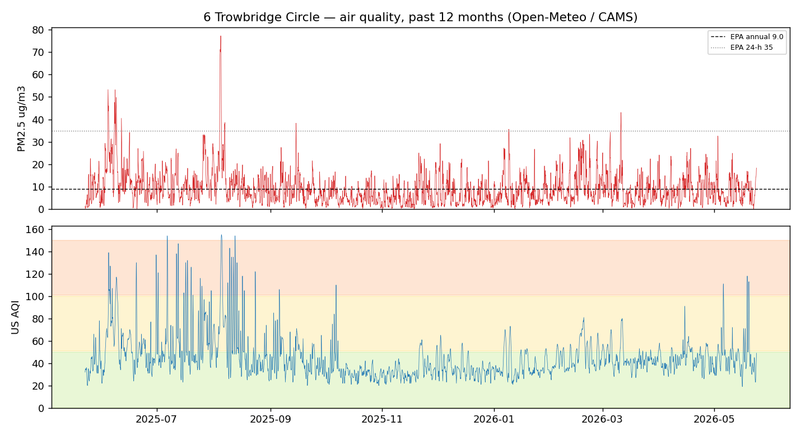
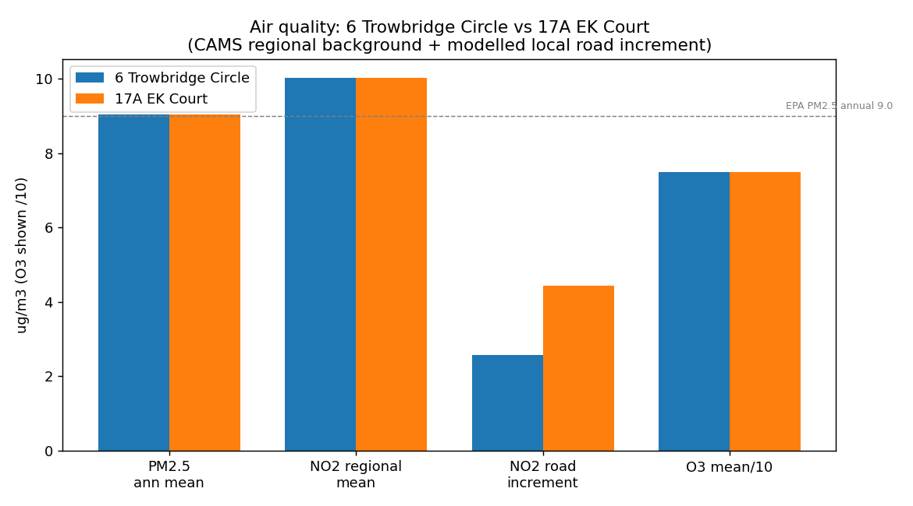

# How loud is 6 Trowbridge Circle vs. the rest of Shrewsbury, MA?

A comprehensive, data-driven **estimate** of outdoor daytime noise. Road
traffic is by far the dominant outdoor noise source in a suburb, so the model
builds the traffic-noise field across town from **measured** inputs and a
physically grounded propagation model, then reads it off at 6 Trowbridge
Circle and at comparison locations.


## TL;DR

6 Trowbridge Circle sits in the **quietest tier** of Shrewsbury — a modelled
daytime Leq of about **51 dB(A)**, tied with the town-center/common area and
several dB below other residential streets. It is a cul-de-sac shielded from
Main Street by intervening houses, and it is **1–3 km from every state
highway**. Homes fronting Route 9, Route 140 or near I-290 are **15–23 dB
louder**, i.e. roughly **3–5× louder** to the ear.

| Location | Leq dB(A) | vs. Trowbridge |
|---|---:|---|
| Shrewsbury Town Hall / common | 48.5 | −2 (about the same) |
| **6 Trowbridge Circle (target)** | **50.5** | reference |
| 17A EK Court (Half Moon Cove, by Rt 20) | 50.9 | +0 (about the same) |
| Sherwood Ave (mid-town residential) | 54.1 | +4 (~1.3× louder) |
| Jordan Rd (Fairlawn, near lake) | 54.7 | +4 (~1.3× louder) |
| Edgemere (residential, off Rt 20) | 55.4 | +5 (~1.4× louder) |
| Reservoir St (far north, near I-290) | 60.2 | +10 (~2× louder) |
| Quinsigamond Ave (lakeside, by Rt 9/290) | 65.3 | +15 (~2.8× louder) |
| Grafton St (fronting MA-140) | 69.5 | +19 (~3.7× louder) |
| Harrington Ave (off Route 9) | 71.4 | +21 (~4.2× louder) |

Scale: every **+10 dB ≈ twice as loud**. Dominant sources at 6 Trowbridge
Circle (after shielding): Main Street (~45 dB, AADT 14,002) and the cul-de-sac
itself; the highways (Route 9 ~41k, I-290 ~86k AADT) are audible only as a
distant ~30–35 dB hum. Aircraft is negligible here (Leq ~12 dB; the Worcester
Airport corridor passes ~7 km south).

## Bottom line — 6 Trowbridge Circle in plain terms

- **vs. 17A EK Court:** ~50–51 dB(A) at both (50.5 vs 50.9) — about the same
  for road noise. But they are different *kinds* of quiet: 6 Trowbridge Circle
  is an inland cul-de-sac shielded by houses, while **17A EK Court is waterfront
  on Half Moon Cove (Lake Quinsigamond), ~200 m from Route 20** — so its noise
  is Route 20 (which you hear), it gets a small (+1 dB) boost from sound
  reflecting off the open water, and it catches **real aircraft overflights**
  (Leq ~40 dB, single-event Lmax ~68 dB) because it sits near the Worcester
  Airport departure corridor. 6 Trowbridge Circle gets essentially none of
  these. Net daytime road Leq is a wash; EK Court's soundscape is just busier.
- **vs. the average Shrewsbury house:** averaging the full model over **900
  sampled homes town-wide**, the typical Shrewsbury house is **~54 dB(A)**
  (mean 54.0, median 53.3), spanning ~44 dB in deep interiors to ~72 dB
  fronting the highways. 6 Trowbridge Circle (50.5) is **~3.5 dB quieter than
  average — quieter than ~79 % of houses in town**; 17A EK Court (50.9, ~76 %).
- **What ~51 dB(A) sounds like outside:** a calm suburban background — birds,
  rustling leaves, and a faint, steady hum of distant highway traffic. Roughly
  the level of a quiet library or a refrigerator a few feet away, and well
  below normal conversation (~60 dB at 1 m). You can chat in a relaxed voice in
  the yard without raising it, and it sits at/under the WHO ~53 dB guideline
  for residential road noise.

(Reproduce with `python3 sound_model.py --survey`.)

## Data (all real, downloaded — see `fetch_data.sh`)

| Layer | Source | Used for |
|---|---|---|
| Road network + **measured AADT**, speed, lanes, class | **MassDOT Road Inventory 2021** (geometry) + **Traffic Inventory 2024** (current AADT + measured truck %) | traffic emission per road |
| Terrain (town-wide ~30 m; **1 m at the house**) | **SRTM** (town) + **USGS 3DEP / MassGIS LiDAR 1 m** (house 3D map, water) | source/receiver heights, terrain & barrier shielding |
| Building footprints (29,468) | **OpenStreetMap** (Overpass) — rasterised to max height | acoustic screening by houses/buildings |
| Open water (Lake Quinsigamond, ponds) | **OpenStreetMap** — rasterised to a water mask | hard/reflective surface acoustics |
| Aircraft | **Worcester Regional Airport (ORH)** runways (OSM) + ops | overflight noise layer |

Measured 2024 volumes anchor the model: **I-290 ≈ 84–88k** AADT (5 % heavy),
Route 9 = 35–46k (6 % heavy), Route 20 ≤ 25k, MA-140 (Grafton St) = 10–17k,
Main Street = 14,002. Truck split (single-unit / combination) is the measured
per-route value from Traffic Inventory, not an assumption.

## Method

Each road is split into ~15 m segments treated as incoherent point
sub-sources (89,781 in total). For every receiver each sub-source is
propagated and the results are energy-summed with a suburban ambient floor.

**Emission** — **FHWA Traffic Noise Model (TNM) REMELs** (US-standard), with
separate automobile / medium-truck / heavy-truck energy-mean A-levels fit to
the published TNM REMEL curves (average pavement, cruise):

```
LE_auto(s) = 26.9 + 25.8·log10(s)     # ~70.7 dBA @ 50 mph, 15 m
LE_med (s) = 41.9 + 21.7·log10(s)     # single-unit trucks
LE_hvy (s) = 60.0 + 14.9·log10(s)     # combination trucks
```

Per-road hourly flow `= AADT/18` is split by the **measured** truck percentages
and energy-summed as an incoherent line of point sub-sources. Calibrated to
TNM (verified: 1000 autos @ 50 mph = **67.0 dBA at 15 m**; I-290 = 77.8 dBA at
15 m), with the correct ~3 dB per distance-doubling line falloff.

**Propagation** (ISO 9613-2 style), per sub-source:

```
Leq = Lw − Adiv − Aatm − ( Abar  if the sight line is blocked
                           Agr   otherwise )
```

- **Adiv** geometric divergence `20·log10(d) + 8` (point source over ground),
  with a 10 m floor (you are never inside the carriageway).
- **Aatm** atmospheric absorption, ~2.5 dB/km (A-weighted, ~10 °C/70 % RH).
- **Agr** ISO 9613-2 alternative soft-ground attenuation,
  `4.8 − (2·hm/d)(17 + 300/d) ≥ 0`, with mean path height `hm` from the DEM.
- **Abar** barrier diffraction (Maekawa `10·log10(3 + 20·N)`, `N = 2δ/λ`,
  λ at 550 Hz, capped at 20 dB). The path-length difference δ is computed from
  the **real terrain+building profile** sampled along each sight line, so a
  receiver screened by rows of houses or by a hill is correctly quieter.
  Obstructions within 12 m of either end (your own house, the curb) are ignored.
- **Water** — where the sight line crosses Lake Quinsigamond (a rasterised
  water mask), the soft-ground attenuation is removed over the water fraction
  and up to **+2.6 dB image reflection** is added. This only matters when a
  *loud* source lies across the water (so it adds +1 dB at waterfront EK Court,
  whose loud source — Route 20 — is on the land side).

**Aircraft** is a separate additive layer: Worcester Airport (ORH) overflights
modelled along the runway-11/29 corridor with a climb/descent altitude profile,
per-operation SEL/Lmax (jet 94/88 dBA @ 305 m; GA quieter), energy-averaged
over a 16-h day. Negligible at Trowbridge (Leq ~12 dB), but ~40 dB Leq /
~68 dB single-overflight Lmax at EK Court near the corridor.

This is why Trowbridge Circle's contribution from Main Street (154 m away) is
~45 dB rather than ~56 dB: the intervening houses diffract it.

### Cross-validation
The USDOT National Transportation Noise Map (TNM-based, **no shielding**) bins
I-290 at 70–80 dBA, Route 9/20 frontage 60–70, and quiet interiors below 45–50.
This model agrees at unshielded frontages (Harrington 71, Grafton 70) and
correctly reads **lower behind barriers/terrain** (Trowbridge 50, Town Hall 49)
— exactly where the no-shielding national map over-predicts.

## What is *not* modelled

- Facade reflections, lateral (around-the-side) diffraction, and meteorological
  focusing (downwind enhancement). Net effect: a few dB, location-dependent.
- Town-wide terrain is 30 m SRTM (the house 3D map uses 1 m LiDAR). Per the
  data audit, 30 m is adequate for mid/far-field shielding; the near-field that
  matters for the target is resolved at 1 m.
- Other non-road sources: rail (Worcester Main Line ~4.9 km off), lawn
  equipment, HVAC, commercial yards. The 40 dB(A) ambient floor stands in for
  these.
- Levels are a daytime average; nights are quieter, peak hours louder. Absolute
  values carry ~±3 dB uncertainty; the **relative ranking** is driven by
  measured volumes and true distances and is robust (and cross-checks against
  the national TNM map above).

## Air quality at 6 Trowbridge Circle

Modelled from the **Open-Meteo / Copernicus CAMS** air-quality model (free, no
key; `python3 air_quality.py`). Generally **Good-to-Moderate**, typical of
suburban central Massachusetts.



- **Right now:** US AQI **30 ("Good")**, PM2.5 2.9 µg/m³.
- **Past 12 months:** US-AQI mean **45**; by daily-max category — **51 % Good,
  38 % Moderate, 10 % USG (unhealthy for sensitive groups), 1 % Unhealthy.**

| Pollutant | Annual mean | 95th pct | Max | Note |
|---|---:|---:|---:|---|
| PM2.5 (µg/m³) | **9.0** | 22.5 | 77.3 | right at the 2024 EPA annual standard (9.0); 24-h peaks (~77) are wildfire-smoke days, still under the 35 24-h standard only on average |
| NO₂ (µg/m³) | 10.0 | 28.6 | 70.8 | **low** — consistent with being far from highways |
| Ozone (µg/m³) | 75 | 124 | 179 | the main regional issue; summer afternoons |

### Local source breakdown (added on top of the regional background)

The CAMS values above are regional. On top of that, a calibrated near-road
decay model (`dC = A·AADT·e^(−d/L)`, calibrated so a 100k-AADT highway kerb ≈
+18 µg/m³ NO₂, per HEI near-road studies) estimates the **local** increment at
the house, and aircraft from Worcester Regional Airport (ORH, ~10 km WSW):

| Local source | NO₂ increment | PM2.5 increment |
|---|---:|---:|
| Road traffic (Main St 154 m + South St 148 m + cul-de-sac) | **+2.6 µg/m³** | +0.4 µg/m³ |
| Aircraft (ORH, ~10 km — LTO emissions stay near the airfield) | +0.06 µg/m³ | +0.008 µg/m³ |

So local traffic adds only ~3 µg/m³ NO₂ to the ~10 µg/m³ regional mean, and
**aircraft is negligible** at this distance. A home right on I-290 or Route 9
would see a *much* larger road term (tens of µg/m³ NO₂ at the kerb).

### Comparison: 6 Trowbridge Circle vs 17A EK Court



| Metric | 6 Trowbridge Circle | 17A EK Court |
|---|---:|---:|
| 12-mo US AQI mean | 45 | 45 |
| PM2.5 annual mean (µg/m³) | 9.0 | 9.0 |
| Ozone mean (µg/m³) | 75 | 75 |
| % days Good / Moderate / USG+ | 51 / 38 / 11 | 51 / 38 / 11 |
| NO₂ regional mean (µg/m³) | 10.0 | 10.0 |
| **NO₂ local road increment** | **+2.6** | **+4.4** |
| PM2.5 local road increment | +0.44 | +0.71 |
| Aircraft NO₂ (ORH) | +0.02 | +0.04 |

**The regional air is identical** — both sit in the same airshed (the CAMS
grid is ~11 km, and they're ~6 km apart), so PM2.5, ozone and US AQI match
exactly. The only real difference is **local traffic**: 17A EK Court is
~200 m from Route 20 (Sunderland Rd / Hartford Tpk / Southwest Cutoff), giving
it a **~70 % larger road-NO₂ increment (+4.4 vs +2.6 µg/m³)** and roughly 60 %
more road PM2.5 than 6 Trowbridge Circle. Both are still well within healthy
ranges and both dwarfed by the regional background — but the same proximity to
Route 20 that makes EK Court louder also makes its near-road air marginally
dirtier. Aircraft is negligible at both (EK Court is ~11 km from Worcester
Airport, Trowbridge ~15 km).

**Takeaways:** Particulate and NO₂ are low — the low NO₂ is the air-quality
echo of the same fact that makes it quiet: it's away from heavy traffic.
Summer **ozone** (regional, not local) and occasional **wildfire-smoke** PM2.5
spikes are the only times air dips into the Moderate/USG range. Annual PM2.5
sits essentially **at** the new stricter EPA limit, like most of the Northeast.

*Caveat:* CAMS is a regional model (~11 km grid), so this is **area** air
quality, not hyperlocal. Immediately beside I-290 or Route 9 the traffic-related
NO₂/PM2.5 would run higher than these values; 6 Trowbridge Circle's distance
from those corridors keeps its traffic-related share on the low end.

## Files / how to run

```bash
python3 sound_model.py          # comparison table (needs only committed data)
python3 sound_model.py --survey # town-wide average-house statistics
python3 sound_model.py --map    # re-render noise_map.png (~1 min)
python3 trowbridge3d.py         # 1 m LiDAR 3D noise map of the house (HTML)
python3 air_quality.py          # air-quality summary + comparison + charts
./fetch_data.sh                 # re-download raw data + rebuild the grids
```

Committed (model runs offline): `sound_model.py`, `ri_roads.json`,
`terrain_grid.npz`, `building_grid.npz`, `water_grid.npz`, `house_dem.npz`,
`house_buildings.json`, plus the rendered `noise_map.png`,
`trowbridge_noise_3d.html`, and air-quality charts. Helpers: `fetch_ri.py`,
`build_dataset.py`, `build_water.py`, `fetch_data.sh`. Requires Python 3 +
numpy (+ matplotlib for charts, plotly for the 3D HTML).

## Sources

- [MassDOT Road Inventory 2021](https://gis.massdot.state.ma.us/arcgis/rest/services/Roads/RoadInventoryHistory/MapServer/17) (geometry/speed) · [Traffic Inventory 2024](https://gis.massdot.state.ma.us/arcgis/rest/services/Roads/TrafficInventoryYearEnd/FeatureServer/1) (AADT + truck %)
- [USGS 3DEP 1 m / EPQS](https://epqs.nationalmap.gov/v1/json) · [MassGIS LiDAR Terrain](https://www.mass.gov/info-details/massgis-data-lidar-terrain-data) · [AWS Terrain Tiles (SRTM)](https://registry.opendata.aws/terrain-tiles/) · [OpenStreetMap / Overpass](https://www.openstreetmap.org/copyright)
- [USDOT National Transportation Noise Map](https://www.bts.gov/geospatial/national-transportation-noise-map) (cross-validation) · [FHWA TNM Technical Manual](https://www.fhwa.dot.gov/environment/noise/traffic_noise_model/) · ISO 9613-2 outdoor sound propagation · [Open-Meteo Air Quality / CAMS](https://open-meteo.com/en/docs/air-quality-api)
- Address verification: [MassGIS Standardized Assessors' Parcels (L3)](https://www.mass.gov/info-details/massgis-data-property-tax-parcels)
