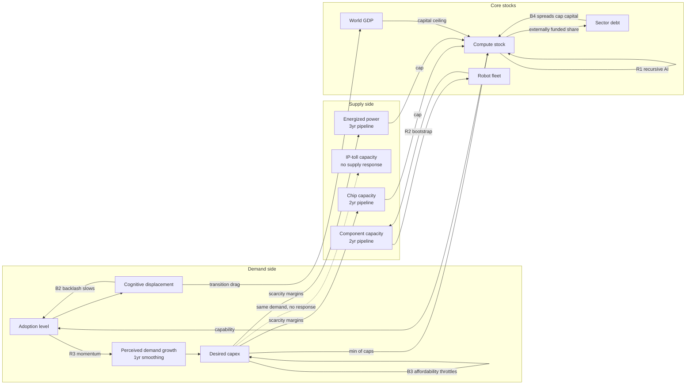

# Meadows v2: Systems-Dynamics Formalization

v1 was a bottleneck-accounting model with **exogenous** supply-growth caps.
That embeds the answer: if chip capacity "can grow at most 55%/yr," rent
duration is an assumption, not a result. Donella Meadows' discipline
(*Thinking in Systems*; *Leverage Points: Places to Intervene in a System*,
1999; the World3 overshoot archetype from *The Limits to Growth*) demands the
opposite: **behavior must emerge from stock-flow structure, feedback loops,
and delays.** v2 (now `rust/singularity-econ`, originally prototyped in
Python) rebuilds the core that way. v1 is retired for
comparison; v2 must reproduce v1's robust findings *and* generate endogenously
what v1 assumed.

## Stocks (state that accumulates)

| Stock | Unit | Notes |
|---|---|---|
| Compute stock | index (1.0 = 2026) | depreciates 25%/yr |
| Energized AI power | GW | fed by the power pipeline |
| Power pipeline | GW, 3 stages | 3rd-order material delay ≈ 3yr build |
| Chip (silicon) capacity | $T/yr output | fed by fab pipeline, 2 stages ≈ 2yr |
| Robot-component capacity | M units/yr | fed by pipeline, 2 stages ≈ 2yr |
| Robot fleet | M units | attrition 8%/yr |
| Cumulative robot production | M units | Wright's-law learning stock |
| Algorithmic efficiency | multiplier | R1 reinforcing stock, saturating |
| Human cognitive/physical workers | M | displacement is a one-way flow |
| AI-sector net debt | $T | funds capex not covered by cash flow |
| Perceived demand growth | %/yr | 1-yr information smoothing (delay) |
| World GDP | $T | productivity + transition drag |

## Named feedback loops (each has a gain switch; tests disable them one at a time)

**B1 — Supply response (balancing, the rent-killer).** Sector utilization →
price/margin above normal → capacity investment accelerates → (construction
delay) → capacity ↑ → utilization ↓ → rents decay. Loop *gain* differs by
moat class: high for components/optics/memory-like capacity (entry is
capital), low for power (permitting/turbine oligopoly caps the response) and
near-zero for IP-moat tolls. **This endogenizes the historical law that
capacity-scarcity rents die 1–3 years after the supply response while
IP-moat rents persist** — v1 asserted it; v2 must produce it.

**B2 — Displacement backlash (balancing).** Fast displacement → social/
regulatory friction → adoption slows. Gain calibrated so ~20%+ yearly
displacement provokes measurable slowdown (politics is a thermostat).

**B3 — Affordability (balancing).** Bottleneck prices raise the effective
cost of AI capacity → demand expansion slows until supply catches up.

**R1 — Recursive AI (reinforcing, saturating).** Capability → AI does AI
R&D → algorithmic efficiency ↑. Saturates (log-logistic) — no infinities.

**R2 — Robot bootstrap / self-replication (reinforcing).** Robot fleet works
in component and robot factories → capacity growth ceiling rises with fleet.
Tiny gain early (the 2028–2032 ramp barely feels it), decisive in the 2030s.
This is the formal version of "robots building robots takes most of a decade
to matter."

*Self-replication upgrade (`robot_self_replication`, on by default).* The
first-cut R2 had two flaws the "robots are a self-sustaining exponential"
critique correctly identified. **(1) The wrong ceiling.** The manufacturing
growth ceiling was the WWII 2.5x/yr *human* mobilization ceiling — how fast
*people* can stand up factories. Once the fleet is large enough to STAFF its
own manufacturing (and superintelligence directs it there), that constraint
dissolves; the binding ceiling migrates toward a finite **machine ceiling**
(`machine_ceiling`, 4x/yr default) set by physical throughput — a factory
reproducing roughly its own mass per year, materials refining, the machines
that make machines. The transition is endogenous: an autonomy fraction
saturating in fleet size (`self_staff_half_m`) and gated by ASI focus, so it
is ~0 before superintelligence and climbs as robots build robots. **(2) The
wrong bind.** Diagnostics showed the legacy fleet was *capacity*-bound at a
human-capex growth rate (~1.7x/yr, far below even the human ceiling), so
lifting the ceiling alone changed nothing — and it was *demand*-capped by
human-labor substitution, so it PLATEAUED (~1.7B) the moment it saturated the
human physical workforce. That plateau is the artifact the critique targeted:
a self-sustaining loop should not stall because human jobs ran out. The fix
injects (a) a self-replication capacity term — the autonomous fleet builds its
own factories, so capacity compounding accelerates toward the machine ceiling
(1.6x → 2.2x/yr as autonomy rises) — and (b) a self-replication demand term —
a `reinvest_share` slice of output plowed back into more robots, scaling with
the FLEET not the workforce. Result: the loop stays exponential past the labor
cap: fleet 15M→351M→3.1B→11B across 2036–2050 vs the plateauing 1.7B legacy.

*Calibration (why 6x/yr and half-staff at 20M, not 4x/60M).* The machine ceiling
is the doubling rate of a self-reproducing industrial base. Carl Shulman's
analysis — existing industrial equipment produces its own mass in a *couple of
months* — puts the pre-superintelligence figure at ~4–6x/yr; 4x (6-month
doubling) was the conservative floor, so the default is **6x** (~4.5-month
doubling), with **10x** (~monthly) exposed as the frontier case (2050 fleet
~17B). The self-staffing half-point is likewise not the ~350M human
manufacturing headcount: a superintelligent robot runs 24/7 and coordinates
perfectly, worth several human workers, so half-staffing arrives near **20M**
robots — the self-replication ramp begins ~2032 rather than ~2036. Endpoint
sensitivity is asymmetric: the self-staff threshold dominates the *mid* (2036–44)
trajectory (dropping it 60M→5M raises the 2040 fleet ~8x), while the machine
ceiling mostly shifts *when* you arrive — the 2050 endpoint is
maintenance/power-dominated and only weakly ceiling-sensitive.
It stays **finite** by three physical bounds: the machine ceiling caps capacity
growth; `reinvest_share` caps how much output recycles vs is consumed; and a
billion-robot fleet draws the SAME constrained grid the datacenters race to
build (`robot_kw_each`, TW-scale by 2050), competing with compute for power.

*The full self-replication feedback web.* The single capacity+demand term above
is only the spine. The actual loop is a web of reinforcing and balancing
couplings, each individually gain-switched and sign-tested (tests/robotics.rs).
The governing lesson from wiring it: **effects only bind if they act on the
ACTIVE channel.** Unit cost floors out by 2036 and feeds only the (inert)
human-labor-arbitrage demand, so cost-routed loops are dead weight; the live
channels are capacity growth, reinvestment, and the power grid. Routing every
loop to its live channel:

- **R-efficiency (learning × autonomy).** Robot-built robots are more capable
  per unit effort as autonomy compounds → each reinvested robot builds MORE
  capacity (routed to capacity yield, not cost). Amplifies.
- **R-flywheel (robots build the compute substrate).** Last year's autonomous
  fleet stands up the fabs, datacenters, and power halls compute lives in →
  chip/power ceilings and construction speedup rise → faster ASI → higher
  autonomy. Closes compute ⇄ robots. Amplifies (~3%).
- **R-materials (self-supply).** Robots mine and refine their own feedstock,
  relieving the input constraint on capacity as autonomy rises. Amplifies.
- **R-energy (robots build their own grid).** The fleet stands up generation,
  added straight to the power stock (bypassing the human power-order pipeline),
  rate-limited by `energy_buildout_ceiling_gw`. *Latent in the benign baseline*
  (the human grid already covers the fleet) but decisive under a throttled grid,
  where it lifts the 2050 fleet by >2x — it relieves the very bind the fleet's
  own draw creates.
- **B-maintenance drag (dominant limiter).** A large deployed fleet spends a
  rising share of its output just staying alive (upkeep, repair, replacement),
  so reinvestment available for GROWTH shrinks with scale. This is the biggest
  single balancing force — removing it more than doubles the 2050 fleet.
- **B-materials depletion.** An exponential robot economy pressures ore grades
  and refining, throttling capacity with √(fleet); at extreme scale it overtakes
  self-supply, putting a physical floor under the loop.
- **B-power gate (the fleet must be RUN, not just built).** Robots and compute
  share ONE grid; after compute takes its share, what remains caps how large a
  fleet can actually operate. This is where the robot draw bites on the fleet
  itself. In the aggressive baseline the (robot-assisted) grid keeps pace, so
  power is a *potential* bind that goes live under any power-supply stress.

**Net behavior of the full web:** the reinforcing amplifiers are individually
modest (~3% each); the dominant dynamic is the core exponential *tempered by
maintenance drag*, which pulls the 2050 fleet from ~34B (maintenance off) down
to ~11B — still 6.5x the plateaued 1.7B legacy, and still visibly exponential
(>1.6x over 2047→2050) rather than flat. The honest systems result is that
"self-sustaining" does not mean "unbounded": it means the loop no longer stalls
at the *human*-labor cap, but it re-binds on *machine*-economy limits —
maintenance, materials, capital, and power. Ablation is clean: master switch
`robot_self_replication = 0` collapses the entire web and recovers the legacy
fleet byte-for-byte.

**R3 — Capex momentum (reinforcing → overshoot).** Investment follows
*perceived* (lagged, smoothed) demand growth plus herding on recent growth.
With perception delays + construction delays, deceleration in demand arrives
AFTER capacity was ordered → **World3-style overshoot-and-correction emerges**
(the endogenous "Cisco moment"), rather than being a threshold statistic.

**B4 — Credit discipline (balancing, delayed).** Capex beyond internally
funded share accumulates sector debt → debt/revenue drives spreads → capital
ceiling tightens. The levered-periphery accident is now a model outcome with
a probability, not a narrative risk.

## Loop diagram

## Delays (the structure that makes timing tradeable)

Material delays are explicit multi-stage pipelines (power 3 stages ≈ 3yr,
fabs/components 2 stages ≈ 2yr); information delays are exponential
smoothing (perception 1yr). Meadows: delays in balancing loops are what
produce oscillation and overshoot — they are why rents exist at all.

## Leverage-point mapping (Meadows' 12, applied)

Where policy/actors could intervene = where trade risk concentrates:

| # | Leverage point | This system | Trade implication |
|---|---|---|---|
| 12 | Constants, parameters | interest rates, tariffs, tax credits | smallest lever; markets overprice these headlines |
| 10 | Stock-flow structure | grid, fabs, ports | slow, expensive — why power rents are durable |
| 8 | Balancing-loop strength | permitting reform, turbine capacity licensing | a permitting shock = B1 gain ↑ = power-rent decay accelerates (kill signal for power longs) |
| 7 | Reinforcing-loop gain | compute-for-R&D allocation | labs self-throttling or racing changes everything upstream |
| 6 | Information flows | interconnection-queue transparency, AI-capability evals | cheap lever; watch for disclosure regimes |
| 5 | Rules | export controls, AI liability law | China chip rules already the binding rule-lever; liability = B2 amplifier |
| 4 | Self-organization | open-source models, robot self-manufacture | R2's long-run gain |
| 3 | Goals | national AI-race vs safety goals | determines whether B2 backlash is allowed to bind |
| 2 | Paradigm | "labor is optional" acceptance, UBI | the fiscal/rates leg of the book |

## Validation contract for v2

1. All v1 invariants hold (ratchets, non-negativity, caps).
2. 2026 anchors match v1 calibration (capex, power, pools).
3. Qualitative parity: power binds most years in the baseline; casualty decay
   back-half loaded; robotics small this decade.
4. **Loop ablations behave as theory predicts** (B1 off → rents persist;
   R3 off → no overshoot; B4 off → more late capex; R2 off → fewer robots
   by 2036; B2 off → faster displacement). These are the real tests.
5. Endogenous results to report: rent-peak year per sector (distribution),
   overshoot magnitude (peak capex vs demand-consistent capex), credit-crunch
   frequency, and how these move the trade book.

## Long-horizon behavior (2050 run — verified stable, structure not forecast)

The model now runs cleanly to 2050 (`examples/long_horizon.rs`; no
non-negativity, boundedness, or finiteness violations). Nothing is
clamped to a 2036 horizon — the long-dated subsystems self-activate, and
the extended run is where several of them finally bind:

- **Power rents normalize ~2040** (margin 0.60 in 2036 -> 0.22 by 2040)
  as the 3-yr power pipeline finally overtakes a displacement rate that
  has stopped rising — then **capital becomes the permanent binding
  constraint**, exactly the World3 hand-off.
- **IP tolls hold 0.62 until ~2046, then decay** — and the trigger is
  endogenous coupling, not decay-by-assumption: orbital compute crosses
  its Wright-cost gate (~0.1 GW-equiv 2045 -> 12.9 by 2050) and a second
  launch supplier breaks the monopoly wedge, which is the first supply
  response the IP monopolist cannot strategically absorb. The model
  generates the two-decade monopoly (ASML/x86 pattern) AND its eventual
  end from structure.
- **Robot self-replication (R2) goes vertical 2038-2050**: with the full
  self-replication feedback web the fleet no longer plateaus at the human-labor
  cap — 15M (2036) -> 351M (2040) -> 3.1B (2044) -> 11B (2050), driven by
  capacity compounding that accelerates from 1.6x to 2.2x/yr as robots staff
  their own factories (vs the legacy 1.7B plateau, which stalled the moment
  it saturated the human workforce). Physical displacement is still the 2040s
  story even with a 2027 singularity — "components early, labor late"
  sequencing holds through ~2044, after which the loop is self-replication-
  demand-bound rather than human-labor-bound, and maintenance drag (not the
  human workforce) becomes the dominant limiter. The exponential stays finite:
  capped by the machine ceiling, the reinvest share, and grid competition
  (the fleet's TW-scale draw contends with datacenter compute).
- **Land autonomization index plateaus ~0.40** (2045) — the trend is
  real and persistent but never reaches the ~1.0 production-for-
  production regime threshold in-model; the thermostat's meltdown ratio
  sits at 0.00 from 2035 on (politics caught up and stayed caught up).
- **The sovereign debt snowball becomes THE question**: debt/GDP reaches
  ~4.2x and the long rate ~6.9% by 2050. Post-2040 the binding scenario
  risk is fiscal sustainability, not AI capability — the model says the
  2040s crisis is a bond-market crisis, not a robot crisis.

## Long-horizon behavior (illustrative, 2045 extension)

Extending the baseline to 2045 (calibration is 2026-2036; beyond that this is
structure, not forecast): power rents persist ~15 years and normalize around
2040-42, after which **capital becomes the permanent binding constraint**;
IP-toll margins hold at ceiling through 2045 (two decades of monopoly rent —
the ASML/x86 pattern); commodity silicon exhibits a second hog-cycle peak
(~2038) — the cycle is structural, not a one-off; and the R2 robot bootstrap
only becomes dominant in the late 2030s (production 17M/yr in 2040, 180M/yr
in 2045; physical displacement reaches just ~25% by 2045 against 2.4B
workers). The humanoid labor economy is a 2040s phenomenon even when the
software singularity happens in 2027 — the strongest statement yet of the
"components early, labor late" sequencing.

## Design note (round-2 review): demand never contracts

`desired_capex` growth is floored at ~+14%/yr by construction (the perceived
signal only accumulates nonnegative terms), so a demand BUST cannot occur —
gluts arise only from supply overshoot, and collapse scenarios only through
the credit channel. This is a deliberate choice consistent with the thesis
frame (the singularity worlds are demand-rich); it means `capacity_glut`
measures supply-side overshoot specifically, and fizzle-driven demand
recessions are outside this model's expressive range (they live in the v1
scenario weights and the valuation layer's fizzle case).

## R4 — Physical acceleration (added on challenge, superintelligence-2027 aggressive baseline)

The strongest external critique of v2 was an internal-consistency one: the
singularity multiplied algorithmic efficiency but left physical construction
delays untouched — yet much of a construction timeline (engineering,
commissioning, yield ramp, paperwork) is cognitive work in disguise. R4 fixes
this: post-singularity, an ASI-diffusion factor (ramping over
`asi_diffusion_years`) pulls material forward through every construction
pipeline (`Pipeline::step_accel`, conserving), raises physical scaling
ceilings (+50% at full diffusion; power gets half — turbine forging is
metallurgy, not paperwork), and dissolves robot integration friction (the
adoption midpoint moves from ~4 years toward ~2). Two deliberate exemptions:
the IP-toll monopolist's expansion is strategic, not construction-bound — it
now expands only under excess demand and never into slack (defending price is
what market power means) — and B3's price signal is capped (2026 evidence:
buyers keep ordering through scarcity; queues run >2x at rising prices).

## Society layer (added overnight July 25-26): politics as a rate detector

Eleven political-economy research briefs (output/history/society_sweep.json)
converged on one structural insight: **democracies regulate the RATE of
displacement, not the level** — US autos killed 40k/yr for four decades with
no design regulation, while Three Mile Island killed approximately nobody
and froze an industry (stringency tracks dread × concentration ×
zero-warning, not body count). The layer (src/society.rs) adds six stocks —
public sentiment (grievance salience), regulatory stringency + enforcement
(3.5-yr lag between them; GDPR's 2018 statute vs 2021 fines), transfer
share of GDP, labor power, institutional trust, consumer trust — with
asymmetric time constants: stringency ratchets and never decays in-horizon
(railroad deregulation took 93 years), sentiment spikes fast and drains in
years (faster once transfers flow), transfers staircase at elections or in
weeks under crisis (Depression 3.5yr vs COVID 4wk).

B2's backlash gain stops being a constant: it becomes a pulse — log-law in
the displacement rate, scaled by sentiment, labor power (which R6 erodes as
displacement hollows out the picket lines: the backlash window is 2026-29,
then closes), transfer damping (the relief valve is how democracies
historically LET fast transitions happen — dockworkers were bought off, not
defeated), and an anti-system reroute when institutional trust collapses.
Incidents (MC-drawn) step stringency +0.55 in dread cases and arm the R7
regulatory-cost spiral — the nuclear-style industry-kill absorbing state,
which the validation contract requires to be a conjunction (dread incident
AND high enforcement AND credit tightening), never a default. Eight
contract tests in tests/society.rs pin all of this.

Baseline consequences: transfers reach the 15%-of-GDP cap by 2031 (the
model now asserts a UBI-scale fiscal response is REQUIRED for the
displacement path the thesis assumes — validation contract #4), sovereign
debt crowding mildly tightens late-decade credit, and adoption tops out at
the consumer-trust ceiling (~0.90) rather than saturating at 1.0.

Post-R4 findings: power STILL binds in ~95% of runs and never normalizes
within the horizon in any draw — the power conclusion survives ASI-speed
construction because acceleration raises compute demand as fast as supply.
Robot production rises ~25% at the 2032 median (0.40M/yr; p90 0.78M);
displacement timing is essentially unchanged (adoption-gated, not
supply-gated). Implementation note: the first R4 build contained an
ordering-rate bug (the order-rate stock was read back from pipeline stages
that acceleration mutates), which produced the diagnostic anomaly of fizzle
out-building the singularity baseline — caught by scenario-ordering sanity
checks before any test was adjusted to fit it.
