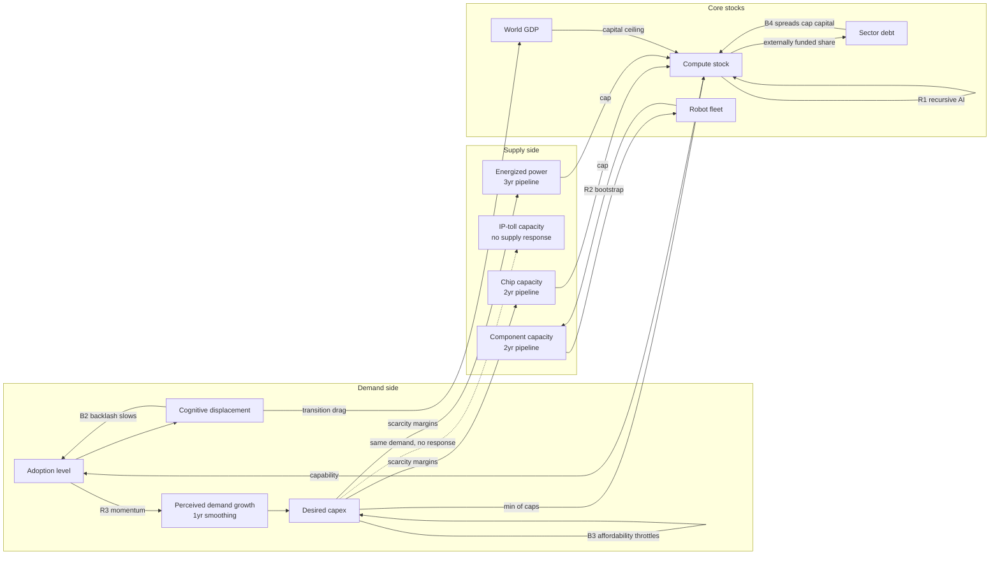

# Meadows v2: Systems-Dynamics Formalization

v1 was a bottleneck-accounting model with **exogenous** supply-growth caps.
That embeds the answer: if chip capacity "can grow at most 55%/yr," rent
duration is an assumption, not a result. Donella Meadows' discipline
(*Thinking in Systems*; *Leverage Points: Places to Intervene in a System*,
1999; the World3 overshoot archetype from *The Limits to Growth*) demands the
opposite: **behavior must emerge from stock-flow structure, feedback loops,
and delays.** v2 (now `rust/singularity-econ`, originally prototyped in
Python) rebuilds the core that way. v1 is retired for
comparison; v2 must reproduce v1's robust findings *and* generate endogenously
what v1 assumed.

## Stocks (state that accumulates)

| Stock | Unit | Notes |
|---|---|---|
| Compute stock | index (1.0 = 2026) | depreciates 25%/yr |
| Energized AI power | GW | fed by the power pipeline |
| Power pipeline | GW, 3 stages | 3rd-order material delay ≈ 3yr build |
| Chip (silicon) capacity | $T/yr output | fed by fab pipeline, 2 stages ≈ 2yr |
| Robot-component capacity | M units/yr | fed by pipeline, 2 stages ≈ 2yr |
| Robot fleet | M units | attrition 8%/yr |
| Cumulative robot production | M units | Wright's-law learning stock |
| Algorithmic efficiency | multiplier | R1 reinforcing stock, saturating |
| Human cognitive/physical workers | M | displacement is a one-way flow |
| AI-sector net debt | $T | funds capex not covered by cash flow |
| Perceived demand growth | %/yr | 1-yr information smoothing (delay) |
| World GDP | $T | productivity + transition drag |

## Named feedback loops (each has a gain switch; tests disable them one at a time)

**B1 — Supply response (balancing, the rent-killer).** Sector utilization →
price/margin above normal → capacity investment accelerates → (construction
delay) → capacity ↑ → utilization ↓ → rents decay. Loop *gain* differs by
moat class: high for components/optics/memory-like capacity (entry is
capital), low for power (permitting/turbine oligopoly caps the response) and
near-zero for IP-moat tolls. **This endogenizes the historical law that
capacity-scarcity rents die 1–3 years after the supply response while
IP-moat rents persist** — v1 asserted it; v2 must produce it.

**B2 — Displacement backlash (balancing).** Fast displacement → social/
regulatory friction → adoption slows. Gain calibrated so ~20%+ yearly
displacement provokes measurable slowdown (politics is a thermostat).

**B3 — Affordability (balancing).** Bottleneck prices raise the effective
cost of AI capacity → demand expansion slows until supply catches up.

**R1 — Recursive AI (reinforcing, saturating).** Capability → AI does AI
R&D → algorithmic efficiency ↑. Saturates (log-logistic) — no infinities.

**R2 — Robot bootstrap (reinforcing).** Robot fleet works in component and
robot factories → capacity growth ceiling rises with fleet. Tiny gain early
(the 2028–2032 ramp barely feels it), decisive in the 2030s. This is the
formal version of "robots building robots takes most of a decade to matter."

**R3 — Capex momentum (reinforcing → overshoot).** Investment follows
*perceived* (lagged, smoothed) demand growth plus herding on recent growth.
With perception delays + construction delays, deceleration in demand arrives
AFTER capacity was ordered → **World3-style overshoot-and-correction emerges**
(the endogenous "Cisco moment"), rather than being a threshold statistic.

**B4 — Credit discipline (balancing, delayed).** Capex beyond internally
funded share accumulates sector debt → debt/revenue drives spreads → capital
ceiling tightens. The levered-periphery accident is now a model outcome with
a probability, not a narrative risk.

## Loop diagram

## Delays (the structure that makes timing tradeable)

Material delays are explicit multi-stage pipelines (power 3 stages ≈ 3yr,
fabs/components 2 stages ≈ 2yr); information delays are exponential
smoothing (perception 1yr). Meadows: delays in balancing loops are what
produce oscillation and overshoot — they are why rents exist at all.

## Leverage-point mapping (Meadows' 12, applied)

Where policy/actors could intervene = where trade risk concentrates:

| # | Leverage point | This system | Trade implication |
|---|---|---|---|
| 12 | Constants, parameters | interest rates, tariffs, tax credits | smallest lever; markets overprice these headlines |
| 10 | Stock-flow structure | grid, fabs, ports | slow, expensive — why power rents are durable |
| 8 | Balancing-loop strength | permitting reform, turbine capacity licensing | a permitting shock = B1 gain ↑ = power-rent decay accelerates (kill signal for power longs) |
| 7 | Reinforcing-loop gain | compute-for-R&D allocation | labs self-throttling or racing changes everything upstream |
| 6 | Information flows | interconnection-queue transparency, AI-capability evals | cheap lever; watch for disclosure regimes |
| 5 | Rules | export controls, AI liability law | China chip rules already the binding rule-lever; liability = B2 amplifier |
| 4 | Self-organization | open-source models, robot self-manufacture | R2's long-run gain |
| 3 | Goals | national AI-race vs safety goals | determines whether B2 backlash is allowed to bind |
| 2 | Paradigm | "labor is optional" acceptance, UBI | the fiscal/rates leg of the book |

## Validation contract for v2

1. All v1 invariants hold (ratchets, non-negativity, caps).
2. 2026 anchors match v1 calibration (capex, power, pools).
3. Qualitative parity: power binds most years in the baseline; casualty decay
   back-half loaded; robotics small this decade.
4. **Loop ablations behave as theory predicts** (B1 off → rents persist;
   R3 off → no overshoot; B4 off → more late capex; R2 off → fewer robots
   by 2036; B2 off → faster displacement). These are the real tests.
5. Endogenous results to report: rent-peak year per sector (distribution),
   overshoot magnitude (peak capex vs demand-consistent capex), credit-crunch
   frequency, and how these move the trade book.

## Long-horizon behavior (illustrative, 2045 extension)

Extending the baseline to 2045 (calibration is 2026-2036; beyond that this is
structure, not forecast): power rents persist ~15 years and normalize around
2040-42, after which **capital becomes the permanent binding constraint**;
IP-toll margins hold at ceiling through 2045 (two decades of monopoly rent —
the ASML/x86 pattern); commodity silicon exhibits a second hog-cycle peak
(~2038) — the cycle is structural, not a one-off; and the R2 robot bootstrap
only becomes dominant in the late 2030s (production 17M/yr in 2040, 180M/yr
in 2045; physical displacement reaches just ~25% by 2045 against 2.4B
workers). The humanoid labor economy is a 2040s phenomenon even when the
software singularity happens in 2027 — the strongest statement yet of the
"components early, labor late" sequencing.

## Design note (round-2 review): demand never contracts

`desired_capex` growth is floored at ~+14%/yr by construction (the perceived
signal only accumulates nonnegative terms), so a demand BUST cannot occur —
gluts arise only from supply overshoot, and collapse scenarios only through
the credit channel. This is a deliberate choice consistent with the thesis
frame (the singularity worlds are demand-rich); it means `capacity_glut`
measures supply-side overshoot specifically, and fizzle-driven demand
recessions are outside this model's expressive range (they live in the v1
scenario weights and the valuation layer's fizzle case).
